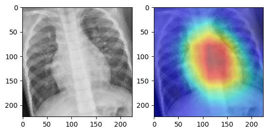

# X-Ray Image Classification for Cardiac Abnormalities

In this project, we aim to classify X-ray images into four categories: ASD (Atrial Septal Defect), Normal, VSD (Ventricular Septal Defect), and PDA (Patent Ductus Arteriosus). We have trained three models: ResNet, EfficientNetB6, and InceptionNetV3, achieving the following accuracies:

- ResNet: 88.55%
- EfficientNetB6: 86.14%
- InceptionNetV3: 84.94%


### Paper

You can through our paper ```Understanding the Risks and Recommendations for Patients with ASD, PDA, VSD.pdf``` to understand more about those diseases.


### Usage

1. Run the ```CHD_preprocessing_and_training.ipynb``` notebook to get your result, all the explanations and steps are present there with well description.

    

### Heatmap Visualization

Here is Heatmap visualization of our X-ray image

